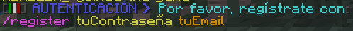

# FAQ: Cuentas

## ¿Porqué tengo que registrarme?

Puesto que nuestro servidor acepta la entrada de cuentas **piratas**, no cuenta con las medidas de autenticación de un servidor normal, la unica forma de asegurar y proteger las cuentas de los usuarios es mediante el registro.

## ¿Cómo me registro?

Al entrar por primera vez al servidor se te pedirá registrarte usando la siguiente sintaxis en el chat \(pulsa la tecla **T** para abrir la barra de chat\):

> /register **`contraseña`** **`email`**

> Ejemplo: /register **`1234567`** **`email@gmail.com`**

Después de registrarte deberás iniciar sesión usando el comando:

> /login **`contraseña`**

> ¿Tienes problemas para crear una contraseña?  
> Te recomendamos usar este sitio para generar una nueva contraseña segura: [https://passwordsgenerator.net/](https://passwordsgenerator.net/)

> ¿Porqué debo proporcionar mi correo?  
> Por favor lee esta sección: [**Olvidé mi contraseña, no puedo entrar.**](https://wiki.mxball.net/faq/preguntas-frequentes#olvide-mi-contrasena-no-puedo-entrar)\*\*\*\*

## Olvidé mi contraseña, no puedo entrar.

Si tu correo electrónico está enlazado a tu cuenta del servidor puedes recuperar la contraseña enviando el siguiente comando:

> /email recover **`tu email`**

#### ¿Cómo sé si mi correo electrónico está enlazado?

Se enlaza tu correo electrónico al momento de registrarte.

> /register **`contraseña`** **`email`**

Si no usaste el formato de registro anterior \(Te registraste antes del **12 de Mayo del 2020**\) y aún tienes acceso a tu cuenta; ve al servidor de cambio de contraseña y después de iniciar sesión usa el comando:

> /email add **`email`** **`confirmar email`**

#### No tengo mi correo electrónico enlazado y no tengo manera de iniciar sesión.

Contacta al staff vía [Discord](https://discord.mxball.net) con pruebas de que seas el dueño de la cuenta perdida.

## ¿Puedo usar VPN/Proxy para unirme al servidor?

No.

## 

