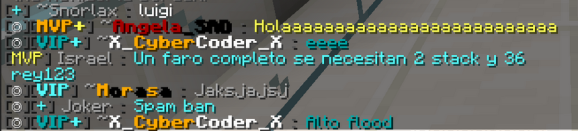

# Reglas

## "Usa el sentido común. Si sabes que está mal, no lo hagas."

## Índice

* [Cuentas](reglas.md#apartado-cuentas)
* [Chat](reglas.md#apartado-chat)
  * [Aclaraciones](reglas.md#aclaraciones)
* [Convivencia](reglas.md#apartado-convivencia)
* [Construcción](reglas.md#apartado-construccion)
* [Discord](reglas.md#apartado-discord)

## Apartado: General

<table>
  <thead>
    <tr>
      <th style="text-align:left">No.</th>
      <th style="text-align:left">Regla</th>
      <th style="text-align:left">Descripci&#xF3;n</th>
      <th style="text-align:left">Tipo de infracci&#xF3;n</th>
      <th style="text-align:left">Notas</th>
    </tr>
  </thead>
  <tbody>
    <tr>
      <td style="text-align:left">1</td>
      <td style="text-align:left">Nombres inapropiados.</td>
      <td style="text-align:left">No se permite entrar al servidor usando nombres que hagan uso de palabras
        soeces.</td>
      <td style="text-align:left">
        
Cuentas nuevas: Alta

        

        
Cuentas existentes: Baja (Mute)

      </td>
      <td style="text-align:left">Soez: Palabra de cualidad vulgar.</td>
    </tr>
    <tr>
      <td style="text-align:left">2</td>
      <td style="text-align:left">Suplantaci&#xF3;n.</td>
      <td style="text-align:left">No se permite hacerse pasar por alg&#xFA;n jugador o miembro de la administraci&#xF3;n
        ya sea cambiandose el nickname o el skin.</td>
      <td style="text-align:left">
        
Suplantar jugador: Baja (C&#xE1;rcel)

        

        
Suplantar miembro de la administraci&#xF3;n: Moderada

      </td>
      <td style="text-align:left"></td>
    </tr>
    <tr>
      <td style="text-align:left">3</td>
      <td style="text-align:left">Nombres/nicknames extensos.</td>
      <td style="text-align:left">No se permite usar caracteres repetidos en nicknames con intenci&#xF3;n
        de sobresalir en el chat.</td>
      <td style="text-align:left">Baja (Mute)</td>
      <td style="text-align:left"></td>
    </tr>
    <tr>
      <td style="text-align:left">4</td>
      <td style="text-align:left">Skins inapropiados.</td>
      <td style="text-align:left">No se permite entrar al servidor usando skins expl&#xED;citos.</td>
      <td
      style="text-align:left">Moderada</td>
        <td style="text-align:left"></td>
    </tr>
    <tr>
      <td style="text-align:left">5</td>
      <td style="text-align:left">VPN/Proxies.</td>
      <td style="text-align:left">Se proh&#xED;be todo uso de programas que permitan cambiar o enmascarar
        tu direcci&#xF3;n IP.</td>
      <td style="text-align:left">Severa</td>
      <td style="text-align:left"></td>
    </tr>
    <tr>
      <td style="text-align:left">6</td>
      <td style="text-align:left">Modificaciones de cliente/Hacks.</td>
      <td style="text-align:left">Se proh&#xED;be usar modificaciones de cliente que pongan en ventaja por
        sobre los dem&#xE1;s jugadores o atenten contra la integridad de nuestros
        servidores.</td>
      <td style="text-align:left">Severa</td>
      <td style="text-align:left">
        
Se permiten mods como:

        <ul>
          <li>Mini-mapas</li>
          <li>Shaders</li>
          <li>Gu&#xED;as de crafteo</li>
          <li>Modificaciones est&#xE9;ticas</li>
        </ul>
      </td>
    </tr>
    <tr>
      <td style="text-align:left">7</td>
      <td style="text-align:left">Uso de m&#xFA;ltiples cuentas.</td>
      <td style="text-align:left">Se proh&#xED;be usar m&#xFA;ltiples cuentas bajo la misma red.</td>
      <td
      style="text-align:left">Severa</td>
        <td style="text-align:left">Se dar&#xE1; permiso especial a jugadores que jueguen con familiares/amigos
          bajo la misma red.</td>
    </tr>
    <tr>
      <td style="text-align:left">8</td>
      <td style="text-align:left">Cambio de nombre/cuenta.</td>
      <td style="text-align:left">Se proh&#xED;be el cambio de nombre/cuenta sin autorizaci&#xF3;n previa.</td>
      <td
      style="text-align:left">Media</td>
        <td style="text-align:left">Si eres jugador <em>premium</em> tendr&#xE1;s que <a href="https://tienda.mxball.net">pagar</a> para
          que se migren los datos de tu cuenta anterior a la nueva.</td>
    </tr>
    <tr>
      <td style="text-align:left">9</td>
      <td style="text-align:left">Bugs y glitches.</td>
      <td style="text-align:left">Se proh&#xED;be hacer uso de bugs o glitches para obtener una ventaja
        sobre los dem&#xE1;s jugadores.</td>
      <td style="text-align:left">Alta</td>
      <td style="text-align:left">Reporta cualquier bug o glitch que encuentres a los <a href="https://discord.mxball.net">miembros de la administraci&#xF3;n</a>.</td>
    </tr>
  </tbody>
</table>

## Apartado: Chat

| No. | Regla | Descripción | Limites | Tipo de infracción | Nota |
| :--- | :--- | :--- | :--- | :--- | :--- |
| 1 | Spam. | Se prohíbe interrumpir el chat con mensajes extensos o repetitivos. |  | Baja \(Mute\) | Ver [aclaraciones](reglas.md#aclaraciones). |
| 2 | Flood. | Se prohíbe obstruir el chat enviando mensajes con caracteres extensamente repetidos. |  | Baja \(Mute\) | Ver [aclaraciones](reglas.md#aclaraciones). |
| 3 | Mayúsculas. | Se limita el uso de mayúsculas en los mensajes del chat. |  | Baja \(Mute\) | Ver [aclaraciones](reglas.md#aclaraciones). |
| 7 | Palabras soeces. | Se permite el uso de palabras soeces pero se limita su uso al momento de dirigir la palabra a otro jugador. |  | Baja \(Mute\) | El hecho de que te lleves pesado con tus amigos no significa que puedas hacerlo con cualquier jugador, respeta y hazte respetar. |
| 8 | Respeto. | Se prohíbe faltarle al respeto a los miembros de la administración o jugadores que exijan ser respetados. |  | Media \(Mute\) |  |
| 9 | Publicidad. | Se prohíbe promocionar otros servidores o productos sin consentimiento previo por parte de los Owners. |  | Severa |  |
| 10 | Doxxeo. | Se prohíbe filtrar datos personales de otros jugadores o miembros de la administración |  | Severa |  |

### Aclaraciones

#### Spam 

Los siguientes ejemplos se pueden considerar como spam:


* Cualquier tipo de **copypasta** \(Textos extensos copiados y pegados a través del internet\)
* Enviar mensajes de poca relevancia en **reiteradas ocasiones** y en un **corto intervalo de tiempo**: "Vengan a mi tienda, vendemos X material a X precio"
* Abusar de las mecanicas del servidor para obstruir el chat:
  * Suicidarse
  * Promocionar una tienda \(/ds\)
  * Salir y entrar al servidor


#### Flood

Los siguientes ejemplos se pueden considerar como flood:


* "Holaaaaaaaaaaaaaaaaaaaaaaaaaaa" Ref: **img\_1**
* "AAAAAAAAAAAAAAAAAAAAAAAAAAAAA"
* "AYUDAAAAAAAAAAAAAAAAAAAAAAAAAAAAAAAA"
* "A" "A" "A" "A"


#### Mayúsculas

Se permite el uso de mayúsculas en los siguientes casos:


* Al mencionar un jugador:
  * "JUANITOOO!!!!!"
* Al enviar palabras simples o cortas: 
  * "AYUDA"
  * "SI"
  * "WTF"
  * "ALV"
  * "XD"
  * "LOOOL"


No se permite el uso de mayúsculas en los siguientes casos:


* Al formar oraciones completas:
  * "¿¿HOLA COMO ESTAN??"
  * "¿COMO CONSIGO UNA RESIDENCIA?"


## Apartado: Convivencia

| No. | Regla | Descripción | Tipo de infracción | Nota |
| :--- | :--- | :--- | :--- | :--- |
| 1 | Acoso. | Se prohíbe cualquier tipo de acoso hacia los jugadores o miembros de la administración ya sea dentro o fuera de nuestros servidores. | Severa |  |
| 2 | Spawnkill. | Se prohíbe matar a los jugadores repetidamente en sus puntos de spawn o campear fuera de sus propiedades para matarlos | Media \(Cárcel\) | Después de 3 muertes consecutivas los asesinatos comienzan a contar como spawnkill. |
| 3 | Pedir cosas. | Se prohíbe pedir items a los miembros de la administración | Baja \(Mute\) |  |
| 4 | Pedir rangos. | Se prohíbe pedir rangos a los miembros de la administración | Alta \(Mute\) |  |

## Apartado: Construcción

<table>
  <thead>
    <tr>
      <th style="text-align:left">No.</th>
      <th style="text-align:left">Regla</th>
      <th style="text-align:left">Descripci&#xF3;n</th>
      <th style="text-align:left">Tipo de infracci&#xF3;n</th>
      <th style="text-align:left">Nota</th>
    </tr>
  </thead>
  <tbody>
    <tr>
      <td style="text-align:left">1</td>
      <td style="text-align:left">Construcciones inapropiadas.</td>
      <td style="text-align:left">Se proh&#xED;be la construcci&#xF3;n de estructuras de car&#xE1;cter expl&#xED;cito
        o simbolog&#xED;a que incite al odio.</td>
      <td style="text-align:left">Media (C&#xE1;rcel)</td>
      <td style="text-align:left"></td>
    </tr>
    <tr>
      <td style="text-align:left">2</td>
      <td style="text-align:left">Grifeo/Vandalismo.</td>
      <td style="text-align:left">Se proh&#xED;be la destrucci&#xF3;n deliberada de estructuras construidas
        por otros jugadores ya est&#xE9;n protegidas o no.</td>
      <td style="text-align:left">Alta (C&#xE1;rcel)</td>
      <td style="text-align:left">
        <ul>
          <li>Destruir &#xE1;reas cerca de las propiedades de los dem&#xE1;s jugadores
            tambi&#xE9;n cuenta como vandalismo (30 bloques).</li>
          <li>Si tu propiedad tiene los permisos mal configurados y alguien se aprovecha
            de eso, no estar&#xE1;s respaldado por esta regla.</li>
        </ul>
      </td>
    </tr>
    <tr>
      <td style="text-align:left">3</td>
      <td style="text-align:left">Obstrucci&#xF3;n de propiedades/portales.</td>
      <td style="text-align:left">Se proh&#xED;be la creaci&#xF3;n de propiedades con intenci&#xF3;n de
        obstruir otras propiedades o limitar acceso a ciertos puntos.</td>
      <td style="text-align:left">Media (C&#xE1;rcel)</td>
      <td style="text-align:left">
        

        
Los portales al End aplican para esta regla.

      </td>
    </tr>
    <tr>
      <td style="text-align:left">4</td>
      <td style="text-align:left">Relojes/Mecanismos intermitentes.</td>
      <td style="text-align:left">Se proh&#xED;be la creaci&#xF3;n de relojes de redstone o mecanismos de
        encendido/apagado r&#xE1;pido.</td>
      <td style="text-align:left">Media(C&#xE1;rcel)</td>
      <td style="text-align:left">Hay excepciones a esta regla, se pueden hacer este tipo de mecanismos
        siempre y cuando funcionen de forma lenta.</td>
    </tr>
  </tbody>
</table>

## Apartado: Discord

* El servidor de chat se rige bajo las [\[Directivas\]](https://discordapp.com/guidelines) y [\[Términos de Servicio\]](https://discordapp.com/terms) de Discord.
  * Prohibido Compartir información personal de algún jugador o miembro del staff.
  * Prohibido compartir contenido que viole el DMCA \(Piratería\).
  * Prohibido subir contenido pornográfico a canales que no tengan el filtro NSFW.
* Cualquier forma de publicidad está estrictamente prohibida a menos que se tenga permiso de los Owners.
* Respeta la temática de cada canal.

